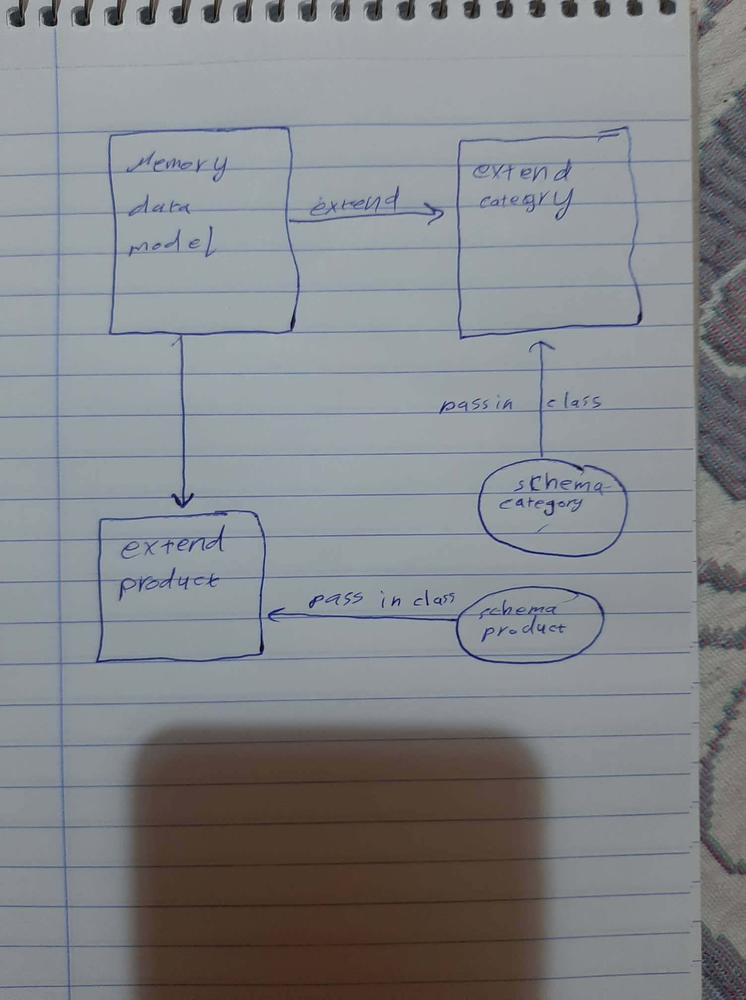

# Class 5

## lab - 5

### Author: Raed eid alrfooh

### Links and Resources

- [submission PR](https://github.com/raed-401-advanced-javascript/class05-lab/pull/1)
- [ci/cd](https://github.com/raed-401-advanced-javascript/class05-lab/pull/1/checks?check_run_id=420998697) (GitHub Actions)

### Setup

#### `.env` requirements (where applicable)

#### How to initialize

- e.g. `npm start`

#### UML

